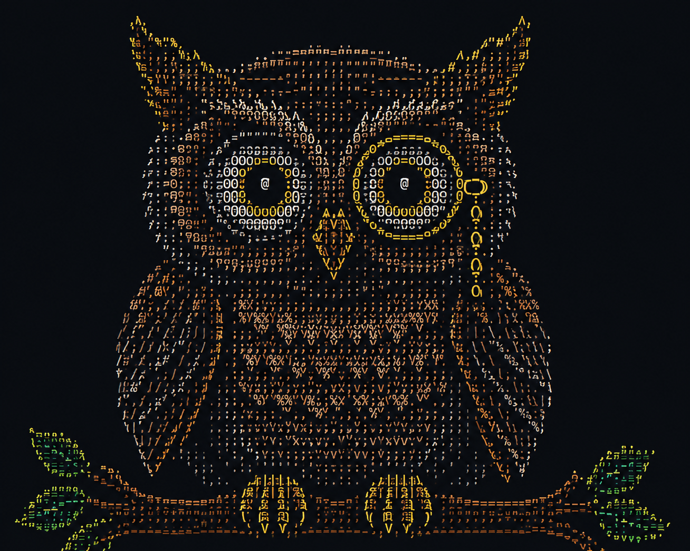
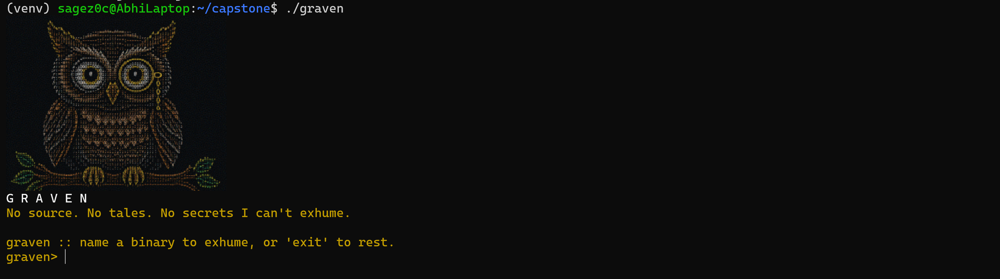
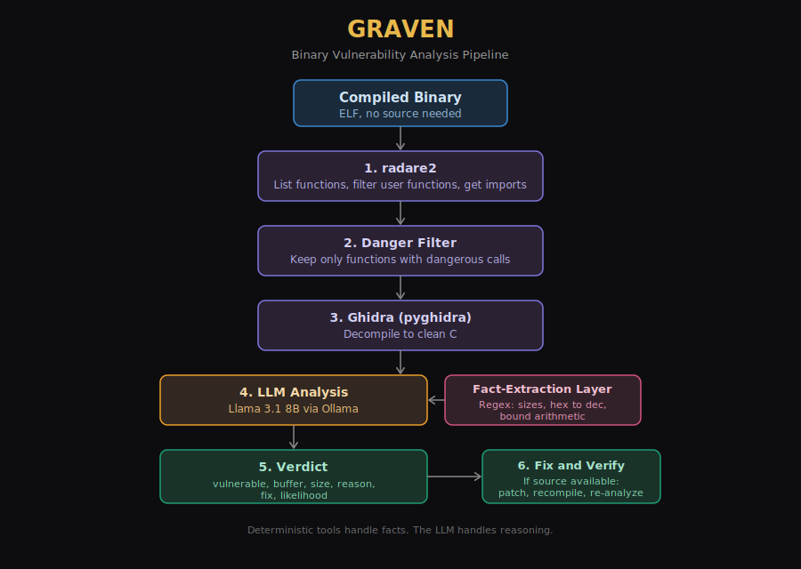
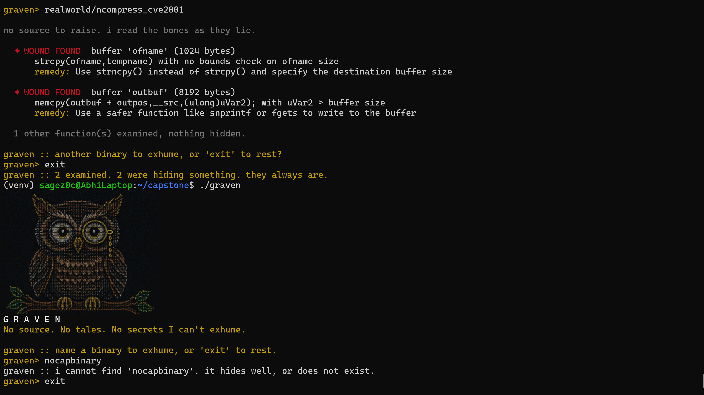
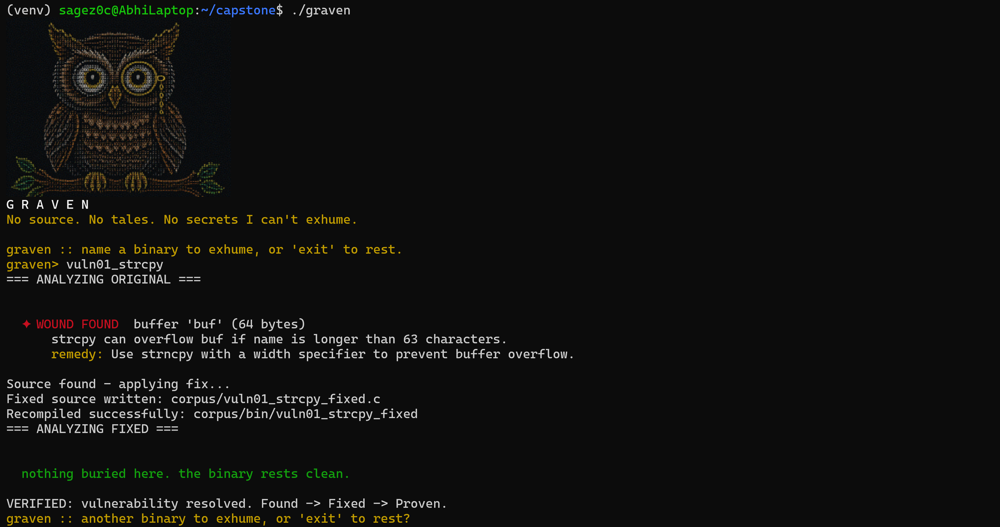

<p align="center">
  
</p>

<h1 align="center">Graven</h1>

<p align="center"><i>Compiled code tells no tales. Until it meets Graven.</i></p>

<p align="center">by Abhilasha Jayaswal</p>

---

Graven is an AI-powered reverse engineering assistant that detects stack buffer overflow vulnerabilities directly from compiled binaries without requiring source code. It reverse-engineers the binary, reasons about each function with a local language model, and when the source is available it automatically applies a fix, recompiles, and re-analyzes to verify that the vulnerability is resolved.

<p align="center">
  
</p>

## What It Does

- Detects stack buffer overflows in compiled binaries with no source code required
- Uses radare2 for analysis and Ghidra (through pyghidra) for clean decompilation
- Reasons about each function with a local Llama 3.1 8B model
- Uses a deterministic fact-extraction layer to handle the precise bound arithmetic the model cannot do reliably
- When source is available, applies a fix, recompiles, and verifies the vulnerability is gone

## Architecture

<p align="center">
  
</p>

## Results

| Test set | Result |
|----------|--------|
| 13-binary corpus | 100% precision, 100% recall |
| 6 external programs (Overflow With Joy) | 6 of 6 correct |
| ncompress 4.2.4 (CVE-2001-1413) | Correctly detected the documented CVE |

Graven was validated on a real documented CVE in production software.

<p align="center">
  
</p>

## Environment

Graven is a Linux-native application. It was developed and tested on WSL2 (Ubuntu) running on Windows.

The project depends on a Linux-based reverse engineering and AI toolchain, including radare2, Ghidra (via pyghidra), Ollama, and chafa.

Native Windows execution is not currently supported. Users on Windows should run Graven through WSL2 with Ubuntu.

## Requirements

System tools (installed with apt or your package manager):

- radare2
- Ghidra (with the GHIDRA_INSTALL_DIR environment variable set) and a JDK
- Ollama with the llama3.1:8b model pulled
- chafa (renders the owl in the terminal greeting)
- gcc (used to recompile during the fix-verify step)

Python packages (in requirements.txt):

- r2pipe
- ollama
- pyghidra

## Setup

### 1. Install System Dependencies

```bash
sudo apt update
sudo apt install -y radare2 chafa gcc default-jdk python3-venv
```

### 2. Install Ollama

Install Ollama by following the official installation instructions for Linux, then pull the required model:

```bash
ollama pull llama3.1:8b
```

### 3. Install Ghidra

Download and extract Ghidra, then set the installation path:

```bash
export GHIDRA_INSTALL_DIR=/path/to/ghidra
```

To make this permanent, add the export command to your ~/.bashrc or ~/.zshrc.

### 4. Create the Python Environment

```bash
python3 -m venv venv
source venv/bin/activate
pip install --upgrade pip
pip install -r requirements.txt
```

## Usage

Launch Graven:

```bash
./graven
```

Then name a binary at the prompt. Graven auto-locates corpus binaries by name.

```
graven> vuln01_strcpy
graven> hackme2
graven> exit
```

If the source is available, Graven runs the full find, fix, and verify loop. If not, it detects the vulnerability and suggests a fix.

<p align="center">
  
</p>

## Project Structure

```
graven/
  src/                 Core code (driver, LLM, orchestrator, fix-verify, eval, voice)
  corpus/              13 test binaries with sources and answer key
  realworld/           External test binaries (hackme, ncompress)
  screenshots/         Demo and result screenshots
  architecture.png     Pipeline diagram
  graven               Launcher
  owl_cropped.png      Mascot
  requirements.txt     Python dependencies
```

## Tech Stack

radare2, Ghidra (through pyghidra), Llama 3.1 8B served locally with Ollama, and Python.
