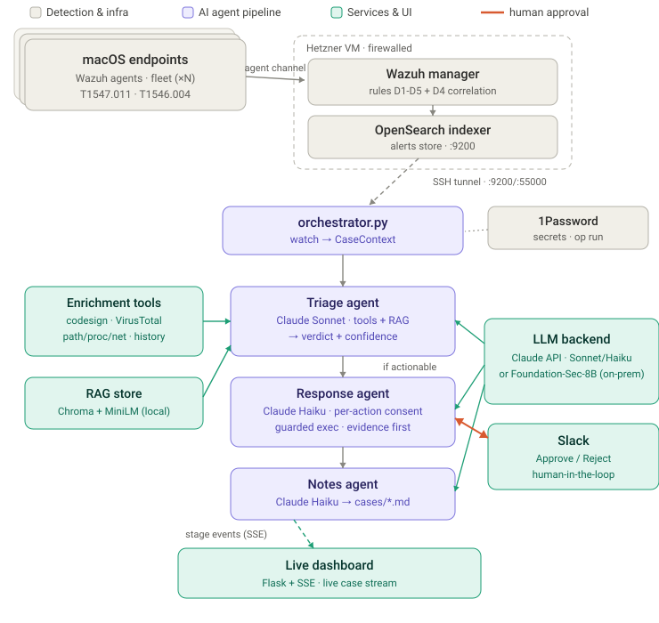
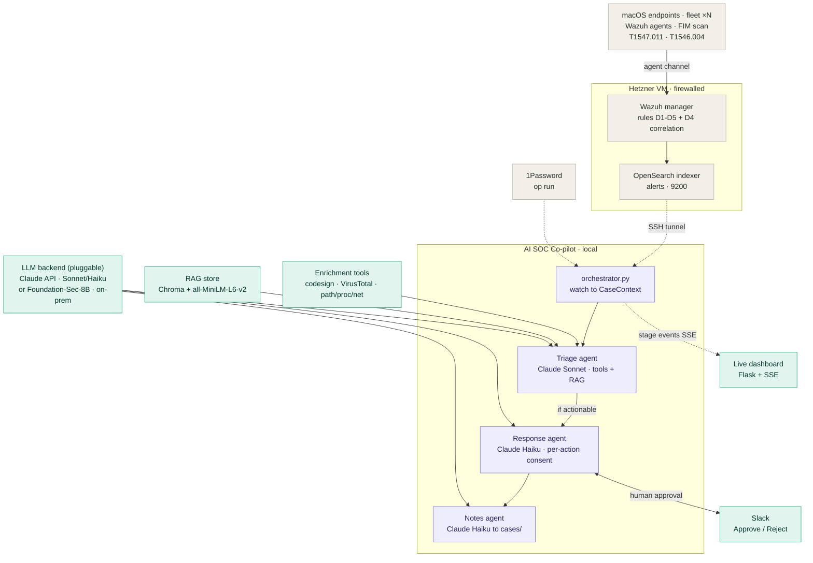

# AI SOC Co-pilot

A multi-agent AI system that automates SOC detection-and-response for a macOS
endpoint. Wazuh detects; a **triage agent** investigates each alert with live
tool calls, a **response agent** proposes an action gated on **Slack approval**,
and a **notes agent** writes an Obsidian-ready case file — all driven by
**analyst-editable Markdown playbooks**, with **RAG** so the agent mirrors the
analyst's prior decisions.

> Change the agent's behavior by editing a playbook file, not the code.

---

## Results (held-out evaluation, n = 86)

Triage verdicts vs. analyst ground truth on 86 held-out cases (6 are
"analyst-exception" cases where the correct answer *contradicts* the naive rule),
benchmarking **Claude** and the open, security-specialized **Foundation-Sec-8B**
each **with/without RAG**, plus a **LoRA fine-tune** (`eval/run_eval.py`; full
write-up + interpretation in **`eval/FINDINGS.md`**):

| arm | accuracy | malicious F1 | over-trigger ↓ |
|---|:--:|:--:|:--:|
| Claude | 0.651 | 0.733 | 0.383 |
| Claude + RAG | **0.802** | **0.857** | 0.191 |
| Foundation-Sec (open, on-prem, $0) | 0.756 | 0.853 | 0.085 |
| Foundation-Sec + RAG | 0.709 | 0.831 | 0.128 |
| Foundation-Sec-LoRA | 0.674 | 0.727 | 0.064 |

Three findings — *(over-trigger = false-alarm rate, lower is better)*:

1. **RAG is the highest-ROI component** — +15 pts accuracy for Claude (0.65 → 0.80)
   and roughly half the over-triggering, for zero training, by recalling the
   analyst's prior judgment on cases the rules alone get wrong.
2. **The security-specialized open 8B is the on-prem sweet spot** — it nearly ties
   Claude+RAG's malicious-detection F1 (0.853 vs 0.857) at **less than half the
   false-alarm rate**, running at **$0/case, air-gapped**.
3. **Small-data LoRA didn't beat retrieval** — fine-tuning ~500 cases slightly
   *degraded* capability (it became trigger-shy), confirming that for a small
   labeled corpus you invest in RAG + a strong base, not a fine-tune.

---

## How it works



<details>
<summary>Same architecture as Mermaid (editable, version-controlled source)</summary>



</details>

Per alert, the orchestrator threads one `CaseContext` through three agents:

1. **Triage** (Claude Sonnet) — loads the matching `triage.md` playbook, investigates
   via tool calls (code signature, SHA-256 + VirusTotal, path reputation, parent
   process, network, host history), is shown the most similar **RAG** cases, and
   returns a verdict + confidence.
2. **Response** (Claude Haiku) — if malicious (≥ threshold) or ambiguous, loads
   `response.md`, proposes actions (kill / remove persistence / quarantine /
   block IP), and **gates every state-changing action on Slack approval**.
3. **Notes** (Claude Haiku) — writes one Markdown case file per alert to `cases/`.

Scope (deliberately narrow, deep): two FIM-detectable techniques, both validated
end-to-end (live detection + agentic response): **T1547.011** LaunchAgent/Daemon
persistence and **T1546.004** shell-configuration modification — plus a **D4
correlation** rule that fires on multi-vector persistence (both on one host).
(T1059.002 AppleScript execution is scoped out: reliable process-execution
telemetry needs osquery — see `docs/DETECTION_RESPONSE_DESIGN.md`.)

**Three model roles** (don't conflate them): Claude = reasoning/decision;
`all-MiniLM-L6-v2` = embedding for RAG retrieval (local, no API); `Foundation-Sec-8B`
= open, security-specialized 8B, benchmarked on-prem as a cost/privacy alternative
(see the results above and `eval/FINDINGS.md`). See `ARCHITECTURE.md`.

---

## Quickstart

Prerequisites: a deployed Wazuh manager with a macOS agent enrolled
(`docs/DEPLOY_WAZUH.md`), the detection rules deployed (`config/wazuh_cluster/local_rules.xml`),
Python 3.11+, and 1Password CLI (`op`) for secrets.

```bash
# 1. deps (into a venv)
python3 -m venv .venv && .venv/bin/pip install -r requirements.txt

# 2. secrets: .env holds only op:// references, resolved at runtime by 1Password
#    (see .env.example / docs/SETUP.md). The indexer/API are reached over an SSH
#    tunnel since those ports aren't exposed:
./scripts/tunnel.sh &

# 3. build the RAG index (once)
.venv/bin/python scripts/generate_dataset.py
.venv/bin/python scripts/embed_dataset.py

# 4. run the pipeline on a sample alert (Slack-gated dry-run)
op run --env-file=.env -- .venv/bin/python orchestrator.py \
    --alert data/sample_alerts/d1_suspicious.json --approval prompt

# 5. evaluate (with vs without RAG)
op run --env-file=.env -- .venv/bin/python eval/run_eval.py --n 20 --compare
```

Flags: `--live` pulls recent alerts from the indexer; `--approval auto|prompt|slack`;
`--execute` runs approved actions for real (default: dry-run).

### Live dashboard (optional)

A decoupled UI service shows each case stream through triage → response → notes in
one window (history + live). Start it, open the page, then run the pipeline — the
pipeline POSTs stage events to it over HTTP (no coupling; degrades if the UI is
off). It runs on localhost now and can move next to Wazuh later via `UI_URL`.

```bash
.venv/bin/python ui/app.py            # dashboard on http://localhost:5001
# then in another terminal, run the pipeline (events stream into the page):
op run --env-file=.env -- .venv/bin/python orchestrator.py \
    --alert data/sample_alerts/d1_suspicious.json --approval slack --execute
```

---

## Repository layout

```
common.py               CaseContext, Claude client + tool loop, playbook loader
orchestrator.py         sequential triage → response → notes pipeline
rag.py                  Chroma retrieval (all-MiniLM-L6-v2)
agents/                 triage_agent · response_agent · notes_agent
tools/                  macos_tools · vt_client · wazuh_client · execution · slack_client
playbooks/<technique>/  editable triage.md + response.md (agentic playbooks)
config/wazuh_cluster/   local_rules.xml (MITRE-tagged detection rules D1–D4)
scripts/                generate_dataset · embed_dataset · tunnel · harden-wazuh · ...
eval/                   run_eval.py, FINDINGS.md, model_comparison.md (results)
finetune/               LoRA fine-tune experiment (build_ft_data.py, LORA.md)
infra/                  Terraform (Hetzner / DigitalOcean) for the Wazuh VM
docs/                   SETUP · DEPLOY_WAZUH · ROTATE_CREDENTIALS · DETECTION_RESPONSE_DESIGN
```

## Documentation

- **`ARCHITECTURE.md`** — model roles, agent communication, deployment architecture
  (decoupled brain), security posture.
- **`docs/DETECTION_RESPONSE_DESIGN.md`** — detections D1–D5, correlation, enrichment,
  confidence scoring, AR/custom/SSH response routing, and how RAG works.
- **`eval/FINDINGS.md`** — the held-out evaluation write-up (Claude vs Foundation-Sec
  ±RAG + LoRA) with interpretation; `eval/LOCAL_MODEL.md` + `finetune/LORA.md` reproduce it.
- **`docs/SETUP.md`** / **`docs/DEPLOY_WAZUH.md`** — accounts, infra, hardening.

## Future improvements

- **Harden the agents ([MITRE ATLAS](https://atlas.mitre.org/)).** The agents ingest
  untrusted alert data and tool output, so they're exposed to LLM-specific attacks
  (prompt injection, tool abuse, context poisoning). Threat-model and defend the
  pipeline against ATLAS techniques — input/output guardrails, constrained tool use,
  and provenance on retrieved context.
- **Move the agents to a server (decoupled brain).** Run the pipeline as a standalone
  service that reaches endpoints via Wazuh Active Response instead of on the endpoint
  itself (the `EndpointAccess` interface is already designed in `ARCHITECTURE.md`).
- **Richer UI.** Case search/filter, historical analytics, multi-analyst queues, and
  inline enrichment detail on the live dashboard.
- **SIEM-agnostic.** Abstract the Wazuh-specific client behind a common alert
  interface so the same agents run against other SIEMs (Splunk, Elastic, …).

## Security notes

Secrets live only as 1Password `op://` references in `.env`, injected at runtime via
`op run` — nothing plaintext on disk. The Wazuh dashboard/indexer/agent ports are
firewalled to an admin-IP allowlist; the indexer/API are reached over an SSH tunnel.
Every state-changing response is human-approved. See `ARCHITECTURE.md` for the full
posture (including the accepted docker-compose credential limitation).
