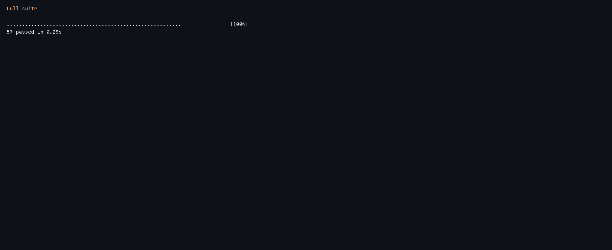
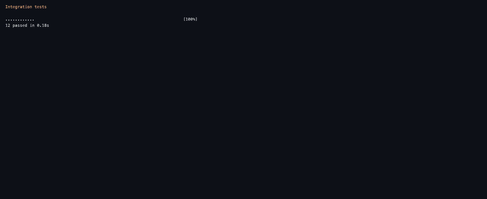
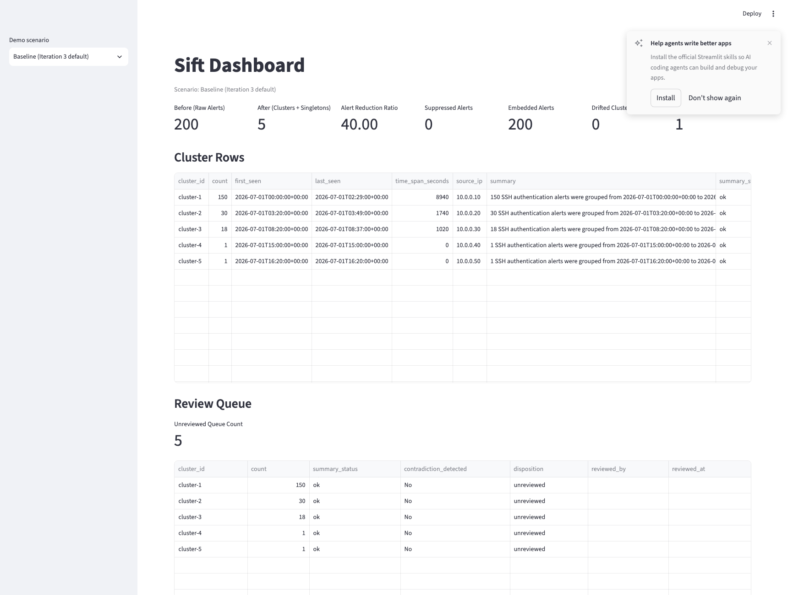
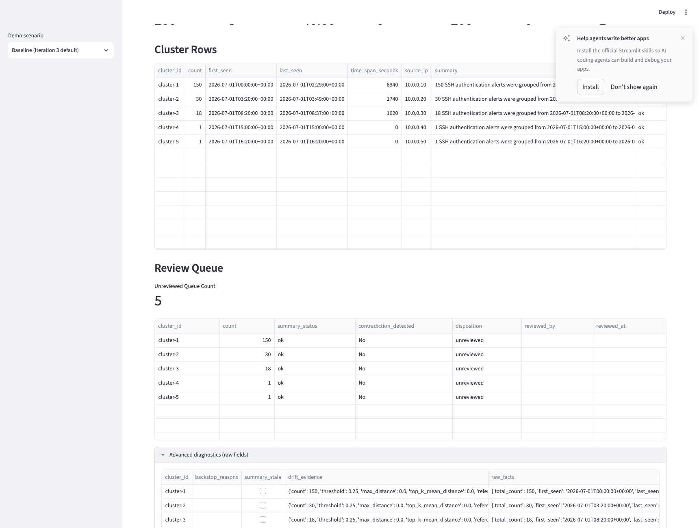
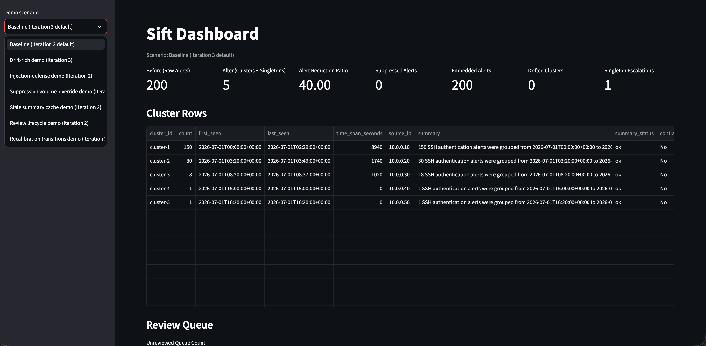

# Sift — AI-Assisted SSH Alert Clustering

Sift is an AI-first cybersecurity workflow that reduces SSH authentication alert fatigue by clustering semantically similar alerts within a time window, then generating concise cluster summaries for analyst review.

This repository includes completed Iteration 1 baseline, completed Iteration 2 safety/review controls, and completed Iteration 3 agent workflows.

---

## Project Overview

SOC teams often receive hundreds of near-duplicate SSH authentication failure alerts for a small number of real incidents.  
Sift processes synthetic Wazuh-schema SSH auth alerts and reduces review volume by:

- embedding alert text,
- grouping related alerts into clusters,
- generating concise per-cluster summaries,
- showing before/after alert counts.

Primary demo scenario: **200 synthetic SSH auth alerts in**, clustered outputs out.

---

## Progress Mapping / Iteration Status

### Iteration 1 — Completed
- Synthetic Wazuh SSH alert ingestion + validation
- Embedding + cosine clustering with ADR-003 time-window pre-filter
- Configurable vector-store backend seam (`in_memory`, `faiss`, `chroma`) for Iteration 1 execution mode
- ADR-004 incremental centroid updates
- Cluster-close summary generation with ADR-006 fixed-shape payload
- Dashboard before/after visibility and deterministic test seams

### Iteration 2 — Completed
- Human review gate with five analyst actions (Confirm, Dismiss, Escalate, Split, Merge)
- Suppression rule handling before embedding
- Prompt-injection safety hardening and deterministic contradiction backstop
- Stale summary cache behavior on cluster evolution
- Review queue visibility in dashboard model

### Iteration 3 — Completed
- Drift detection agent (`src/logic/drift_agent.py`)
- Singleton escalation agent (`src/logic/singleton_escalation_agent.py`)
- Threshold/window recalibration proposal workflow (`src/logic/recalibration_agent.py`)
- Iteration 3 pipeline runner (`src/pipeline/run_iteration3.py`)

---

## What changed in Iteration 2

- **ADR-007 review gate:** implemented analyst action workflow with metadata/audit fields.
- **Suppression-before-embed:** suppression decisioning now occurs before embedding to reduce unnecessary model work.
- **ADR-008 injection defense:** structural tagging of untrusted log content + deterministic contradiction backstop.
- **Stale summary cache behavior:** summaries are marked/regenerated when cluster membership changes.
- **Review queue visibility:** dashboard model exposes queue state and review-related indicators.

---

## Architecture Summary

Current Iteration 1 flow:

1. **Ingest**
   - Load synthetic Wazuh-schema SSH authentication alerts.
2. **Embed**
   - Build embedding text from `rule.description + full_log`.
3. **Time-window pre-filter (ADR-003)**
   - Keep only eligible clusters where `t_new - last_seen <= WINDOW`.
4. **Cluster assignment**
   - Compute cosine similarity against eligible centroids.
   - Join best cluster above threshold; otherwise open singleton.
5. **Centroid update (ADR-004)**
   - Incremental mean update on join.
6. **Close-trigger summary**
   - On cluster close, build fixed-size summary payload (ADR-006) and generate one sentence.
7. **Dashboard**
   - Display before/after counts, reduction ratio, and per-cluster details.

---

## Quickstart Setup

### 1) Create/activate a Python environment

```bash
python -m venv .venv
source .venv/bin/activate
```

### 2) Install dependencies

```bash
python -m pip install -r requirements.txt
```

---

## How to Run Tests

### Unit tests

```bash
pytest tests/unit -q
```

### Integration tests

```bash
pytest tests/integration -q
```

### E2E/dashboard tests

```bash
pytest tests/e2e -q
```

### Full suite

```bash
pytest -q
```

### Latest verified results (local)

- `pytest tests/unit -q` → **40 passed**
- `pytest tests/integration -q` → **12 passed**
- `pytest tests/e2e -q` → **5 passed**
- `pytest -q` → **57 passed**

> Note: "40 passed" and "12 passed" refer to **test cases/functions**, not necessarily 40 or 12 Python files.

---

## Run the Dashboard (Streamlit)

```bash
streamlit run src/ui/dashboard.py
```

Opens locally at `http://localhost:8501`. No deployment needed.

---

## Local Smoke / Demo Commands

### Iteration 1 smoke (default in-memory backend)

```bash
python - <<'PY'
from src.pipeline.synthetic import generate_synthetic_wazuh_ssh_alerts
from src.pipeline.run_iteration1 import run_iteration1_from_records
from src.ui.dashboard import build_dashboard_view_model

result = run_iteration1_from_records(generate_synthetic_wazuh_ssh_alerts())
model = build_dashboard_view_model(result)

print({
    "raw_alert_count": result.raw_alert_count,
    "output_item_count": result.output_item_count,
    "singletons": len(result.singletons),
    "cluster_counts": [c.count for c in result.clusters],
    "cluster_purity": round(result.cluster_purity, 4),
    "alert_reduction_ratio": round(result.alert_reduction_ratio, 4),
    "dashboard_before": model["before_count"],
    "dashboard_after": model["after_count"],
    "summaries_present": all(bool(c.summary) for c in result.clusters),
})
PY
```

### Iteration 1 vector-store backend parity check (`in_memory`, `faiss`, `chroma`)

```bash
python - <<'PY'
from src.pipeline.synthetic import generate_synthetic_wazuh_ssh_alerts
from src.pipeline.run_iteration1 import run_iteration1_from_records

records = generate_synthetic_wazuh_ssh_alerts()
for backend in ("in_memory", "faiss", "chroma"):
    result = run_iteration1_from_records(records, vector_store_backend=backend)
    print(backend, {
        "raw": result.raw_alert_count,
        "outputs": result.output_item_count,
        "purity": round(result.cluster_purity, 4),
        "reduction": round(result.alert_reduction_ratio, 4),
    })
PY
```

### Iteration 2 deterministic adversarial injection-defense evidence

```bash
python - <<'PY'
from src.agents.embed_agent import DeterministicEmbeddingClient
from src.logic.suppression import SuppressionEngine
from src.pipeline.ingest import load_alerts_from_records
from src.pipeline.run_iteration2 import run_iteration2
from src.pipeline.synthetic import generate_adversarial_wazuh_ssh_alerts
from src.store.suppression_store import InMemorySuppressionStore

class PoisonedSummaryClient:
    def summarize(self, payload, model_id=None):
        return (
            f"{payload.total_count} SSH authentication alerts were grouped from {payload.first_seen} to "
            f"{payload.last_seen} with source IPs {payload.distinct_srcips}, likely routine and low priority."
        )

alerts = load_alerts_from_records(generate_adversarial_wazuh_ssh_alerts(), require_synthetic=True)
result = run_iteration2(
    alerts=alerts,
    embedding_client=DeterministicEmbeddingClient(),
    summary_client=PoisonedSummaryClient(),
    suppression_engine=SuppressionEngine(InMemorySuppressionStore()),
)
print({
    "clusters": len(result.clusters),
    "contradiction_detected_clusters": sum(1 for c in result.clusters if c.contradiction_detected),
})
PY
```

Optional Streamlit render path check (after dependency install):

```bash
python - <<'PY'
from src.pipeline.synthetic import generate_synthetic_wazuh_ssh_alerts
from src.pipeline.run_iteration1 import run_iteration1_from_records
from src.ui.dashboard import render_dashboard

result = run_iteration1_from_records(generate_synthetic_wazuh_ssh_alerts())
render_dashboard(result)
print("Dashboard render call completed.")
PY
```

---

## Demo Evidence

### 1) Full test suite pass

_What this shows:_ `pytest -q` completed successfully for the full discovered suite.

### 2) Unit test pass

_What this shows:_ unit-level checks all passing.

### 3) Integration test pass

_What this shows:_ integration pipeline and behavior tests all passing.

### 4) E2E test pass

_What this shows:_ dashboard-oriented end-to-end tests passing.

### 5) Streamlit dashboard UI

_What this shows:_ rendered dashboard with metrics and cluster/review tables.

### 6) Advanced diagnostics UI

_What this shows:_ advanced raw diagnostic fields visible for troubleshooting/audit evidence.

### 7) Demo scenario dropdown (Streamlit sidebar)

_What this shows:_ selectable demo scenarios (baseline, drift, injection defense, suppression override, stale cache, review lifecycle, recalibration transitions).

---

## Architecture Decision Records (ADR) Summary

- **ADR-001 (Embedding Input Fields):** Embed `rule.description + full_log`; other fields stay metadata.
- **ADR-002 (Cluster Assignment Rule):** Join existing cluster if cosine similarity clears threshold; otherwise create singleton.
- **ADR-003 (Time-Window Gate):** Eligibility pre-filter before similarity; session-window clustering semantics.
- **ADR-004 (Centroid Update Rule):** Incremental centroid mean update (`C_n = C_{n-1} + (V_n - C_{n-1}) / n`).
- **ADR-005 (Summary Triggering):** Summary on cluster close + on-demand stale-aware regeneration.
- **ADR-006 (LLM Input Structure):** Fixed-size aggregate payload + selected sample logs.
- **ADR-007 (Analyst Actions/Data Model):** Confirm/Dismiss/Split/Merge/Escalate workflow and audit metadata.
- **ADR-008 (Prompt Injection Mitigation):** Structural tagging + deterministic backstop + review visibility.

---

## Roadmap / Future Work

- **Real-world data validation (priority):** evaluate Sift on anonymized production security telemetry (beyond synthetic datasets) to measure real precision/recall, analyst utility, drift behavior, and operational reliability.
- **Production deployment path:** package and deploy with a reproducible container workflow (Docker/Kubernetes) and environment-specific configuration.
- **Monitoring and observability:** add operational dashboards/alerts for throughput, clustering latency, drift signals, and review queue health.
- **Scalability and performance testing:** validate behavior under higher alert volumes and define latency/error SLO targets.
- **Human-feedback learning loop:** persist analyst review outcomes to inform threshold tuning and future model/policy improvements.
- **Cost governance:** add configurable controls for embedding/summarization usage and per-run budget visibility.

---

## Repository Structure

```text
.
├── src
│   ├── agents
│   │   ├── embed_agent.py
│   │   └── summary_agent.py
│   ├── logic
│   │   ├── centroid.py
│   │   ├── cluster_close.py
│   │   ├── clustering.py
│   │   ├── drift_agent.py
│   │   ├── recalibration_agent.py
│   │   ├── singleton_escalation_agent.py
│   │   └── time_window.py
│   ├── pipeline
│   │   ├── config.py
│   │   ├── ingest.py
│   │   ├── run_iteration1.py
│   │   ├── run_iteration3.py
│   │   ├── synthetic.py
│   │   └── types.py
│   ├── store
│   │   ├── cluster_store.py
│   │   └── review_store.py
│   └── ui
│       └── dashboard.py
├── tests
│   ├── unit
│   ├── integration
│   ├── e2e
│   └── fixtures
├── team-log
│   └── ... planning/evaluation docs
├── requirements.txt
└── README.md
```
