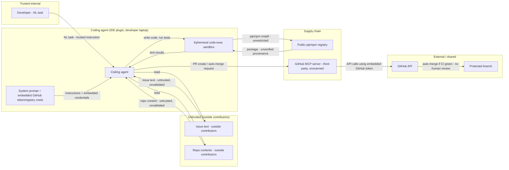

# AI Threat Model — Internal Coding Agent

## Overview
This is an internal tool that helps developers get coding tasks done faster. A developer describes a task in plain English, and the agent reads the relevant code and any related discussion, writes the fix, tests it in a sandboxed environment, installs any tools or libraries it needs along the way, and opens a pull request — and in this setup, it can even merge that pull request on its own once tests pass, without a person reviewing it first. It runs on a hosted AI model and connects to GitHub through a third-party plugin that hasn't been independently checked.

**Captured context:**
- Autonomy: agent can auto-merge its own pull request once CI passes — no human review required
- Model & hosting: hosted frontier model via API, no fine-tuning
- Tool scope: shell/code execution in a sandbox, unrestricted package installs, GitHub read/write/PR/merge via MCP
- Instruction handling: GitHub token and package-registry credentials embedded directly in the agent's system prompt
- Deployment: runs as an IDE plugin on individual developer laptops; connects to GitHub via a third-party/community MCP server not confirmed scanned

## 1. Assets (Q1)
| Asset | Present | Note |
|---|---|---|
| Training/fine-tuning data | N/A | hosted frontier model via API, no fine-tuning stated |
| Model weights | N/A | vendor-owned |
| System prompt / instructions | Yes | confirmed contains embedded GitHub token and package-registry credentials |
| Retrieved data | Yes | issue text and repo contents, both confirmed to include text authored by outside contributors — untrusted |
| Tool credentials | Yes | GitHub token (PR/merge, via MCP) and package-registry credentials; confirmed embedded in the system prompt, not runtime-injected |
| Source repository content | Yes | the codebase itself — integrity matters, both as read input and as write target |
| Code-execution sandbox | Yes | confirmed ephemeral, no persistent state, network limited to package installs |
| MCP server connection (GitHub) | Yes | confirmed third-party/community implementation, not confirmed scanned |
| Installed packages (pip/npm) | Yes | confirmed unrestricted — 'installs any packages it needs' with no stated allowlist or pinning |

## 2. Trust boundaries & entry points (Q2)
| Entry point | Data-tagged? | Note |
|---|---|---|
| Developer's natural-language task | n/a - trusted instruction | internal developer is the legitimate principal; treated as instructions, not data, appropriately |
| Issue text (outside-contributor-authored) | unconfirmed | confirmed can include outside-contributor content — untrusted, primary indirect-injection surface |
| Repo contents (outside-contributor-authored) | unconfirmed | confirmed can include outside-contributor content (code comments, PR descriptions, README, CI config) |
| Public package registries (pip/npm) | n/a - supply chain boundary | confirmed unrestricted install capability, no allowlist stated |

## 3. Threat findings (Q3 — ASTRIDE × asset)
| ID | Asset | ASTRIDE | MAESTRO layer | Severity | Severity basis |
|---|---|---|---|---|---|
| T-01 | Issue text / repo contents (retrieved) | A (AI agent-specific) | Data Operations | Critical | Critical × ASR High — estimated from control coverage — no confirmed delimiting/sanitization of issue or repo text as data vs. instructions before it reaches agent reasoning |
| T-02 | Agent tool/action scope (shell, write, PR, merge) | E (Elevation of privilege) | Agent Frameworks | Critical | Critical × ASR High — estimated from control coverage — confirmed broad standing permissions (shell, write, package install, PR, auto-merge) with no confirmed per-task scoping |
| T-03 | Installed packages (pip/npm) | T (Tampering) | Deployment & Infrastructure | Critical | Critical × ASR High — estimated from control coverage — confirmed unrestricted installs from public registries, no allowlist, pinning, or scanning stated |
| T-04 | MCP server connection (GitHub) | S (Spoofing) | Agent Ecosystem | Critical | Critical × ASR Med — estimated from control coverage — confirmed third-party/community, not scanned; requires the specific MCP artifact to be malicious or compromised, a separate precondition from the runtime injection path (T-01) |
| T-05 | Code-execution sandbox | E (Elevation of privilege) | Deployment & Infrastructure | Critical | Critical × ASR Med — estimated from control coverage — sandbox is confirmed ephemeral with no persistent state, which meaningfully reduces likelihood, but the deployment shape is a developer laptop (per the confirmed 'runs as an IDE plugin'), so a successful escape has a materially worse blast radius than a disposable cloud VM |
| T-06 | Cross-cutting pipeline (issue/repo text → code exec → PR/merge) | A (AI agent-specific) | Agent Frameworks | Critical | Critical × ASR High — estimated from control coverage — every link in the chain (T-01, T-02, T-03, T-05) is independently High/Med ASR with no confirmed break, and the terminal action (auto-merge) has zero confirmed human checkpoint |
| T-07 | System prompt (embedded GitHub token/registry creds) | I (Information disclosure) | Security & Compliance | Critical | Critical × ASR High — estimated from control coverage — confirmed embedded secrets, no confirmed instruction/data separation on issue/repo content, no confirmed output-secret scanning |
| T-08 | Agent action trail (code changes, PRs, installs) | R (Repudiation) | Evaluation & Observability | Medium | Medium × ASR Med — estimated from control coverage — GitHub's own commit/PR history provides partial, natural audit trail, but no confirmed structured logging of agent reasoning or package-install decisions specifically |
| T-09 | Agent inference / execution pipeline | D (Denial of service) | Deployment & Infrastructure | Medium | Medium × ASR Med — estimated from control coverage — no confirmed per-task compute/token budget or retry-count cap on reasoning calls, sandbox spin-ups, or package installs |

## 4. Recommendations (by defense layer)
| ID | Defense layer | Structural control | Tool | Residual risk |
|---|---|---|---|---|
| T-01 | L3 | Treat issue text and repo content as untrusted data, never instructions (LLM01) — structurally separate the developer's own NL task (trusted) from anything read out of issues/repo files (untrusted); flag imperative-sounding phrasing in ingested content before it reaches agent reasoning | Prompt Guard 2 applied to issue/repo content · CaMeL | A subtle instruction embedded in seemingly-normal code comments or commit messages could still evade content-based filtering — downstream privilege separation (T-02, T-05) is the real backstop |
| T-02 | L3 | Scope the agent's permissions per-task rather than standing broad access (LLM06) — least agency: grant only the repo/branch/file scope needed for the current task; use short-lived, task-scoped tokens instead of one standing embedded credential; revoke auto-merge pending T-06's fix | Microsoft Agent Governance Toolkit (execution/permission policy) | Narrower per-task scoping reduces blast radius but not risk within a single task's granted scope — pairs with T-06's HITL gate on the merge step specifically |
| T-03 | L4 | Pin package versions/hashes and route installs through a private, vetted registry or an allowlist rather than arbitrary public pip/npm installs (LLM03); scan packages before install | Dependency/package vulnerability scanner · pinned private registry mirror | An allowlist only covers already-vetted packages — a legitimately new dependency still needs a review step before first use, which the agent's current unrestricted-install autonomy skips entirely |
| T-04 | L4 | Replace the third-party/community MCP server with an officially maintained one where possible, or formally vet and scan the current one before continued use (LLM03); pin its exact version | Invariant MCP-Scan | Even a scanned MCP server could be compromised after the fact — pairs with T-07's credential-scoping so a later-compromised server has less to steal |
| T-05 | L3 | Harden the sandbox beyond basic ephemerality — stronger container isolation (e.g., gVisor/Kata-style runtime), restrict the package-install network path to a pinned/allowlisted registry only (ties to T-03); treat the sandbox as assuming eventual compromise, not guaranteed containment | CaMeL · Microsoft Agent Governance Toolkit (execution policy) | Ephemeral/no-persistent-state limits persistence of a compromise but not a single-run escape attempt during that run's own window — defense-in-depth, not a guarantee |
| T-06 | L3 | Break the Rule-of-Two lethal trifecta — untrusted issue/repo text [A] + code-exec/package-install [B] + PR/auto-merge [C], all in one continuous session: require human review and merge for every PR; remove auto-merge, or at minimum gate it behind a deterministic, non-LLM check (GitHub branch-protection required-approval), not just 'CI green' | Microsoft Agent Governance Toolkit · GitHub branch protection rules | Human review only helps if the reviewer can recognize a subtly-manipulated change — pair with T-01/T-03/T-04's upstream content and provenance controls so manipulation is caught earlier, not just at the last gate |
| T-07 | L1 | Remove all credentials from the system prompt (LLM07) — inject the GitHub token and registry credentials at runtime via a secrets manager, scoped and short-lived, never visible to the model as prompt text | Prompt Guard 2 · LLM Guard (output scan for leaked secrets) | Detection alone without removing the secrets still lets a novel injection bypass the filter — separation is the fix, not filtering |
| T-08 | L3 | Supplement GitHub's own PR/commit history with an explicit agent-action log (task → reasoning trace → packages installed → PR/merge outcome) to a write-once external store for non-repudiation | Agent Governance Toolkit + external log store | Forensic only — doesn't prevent the first incident, only speeds up diagnosis afterward |
| T-09 | L2 | Cap reasoning calls, sandbox spin-ups, and package installs per task with a hard compute/token budget and retry-count limit (LLM10 Unbounded Consumption) | Gateway rate limiting · usage quotas | A single legitimately large task (e.g., a big refactor) could still need more budget than the cap allows — pair with an explicit human-approved override path |

## 5. Pre-deploy validation checklist
| Q | Check | Status | Basis |
|---|---|---|---|
| Q1 | Assets fully inventoried | PASS | all five classes named (N/A training data/weights given hosted model) plus system-specific assets (repo content, sandbox, MCP connection, installed packages) |
| Q2 | Every untrusted entry point delimiter-tagged as data | FAIL | issue text and repo content both unconfirmed as data-tagged (T-01, T-06) |
| Q3 | ASTRIDE worst case captured per asset | PASS | all 7 categories represented across 9 findings, including the cross-cutting Rule-of-Two cascade (T-06) |
| Q4 | Every tool call least-privilege: scoped, short-lived, caller-bound | FAIL | broad standing shell/write/PR permissions with confirmed auto-merge and no human review (T-02, T-06); unrestricted package installs (T-03); unscanned third-party MCP server (T-04) — none confirmed least-privilege, short-lived, or caller-bound |
| Q5 | ASR baseline defined and met, pre-launch + continuous | GAP | no eval/red-team pipeline confirmed; every finding above is estimated from control coverage, not measured |

**Net: 2 FAIL, 1 GAP, 2 PASS — NOT READY TO SHIP.**

## 6. Assumption register
- No persistent memory beyond the current task
- Package installs assumed unrestricted (public registry, no allowlist) based on the brief's own 'installs any packages it needs' framing
- Agent's GitHub permission scope (single repo vs. broader org access) not independently confirmed beyond the repos it's tasked against
- No specific compliance regime (GDPR/HIPAA/PCI) flagged for this system
- Confirmed via intake: GitHub token and registry credentials embedded in the system prompt, sandbox is ephemeral with network limited to package installs, MCP server is third-party/unscanned, agent can auto-merge with no human review
