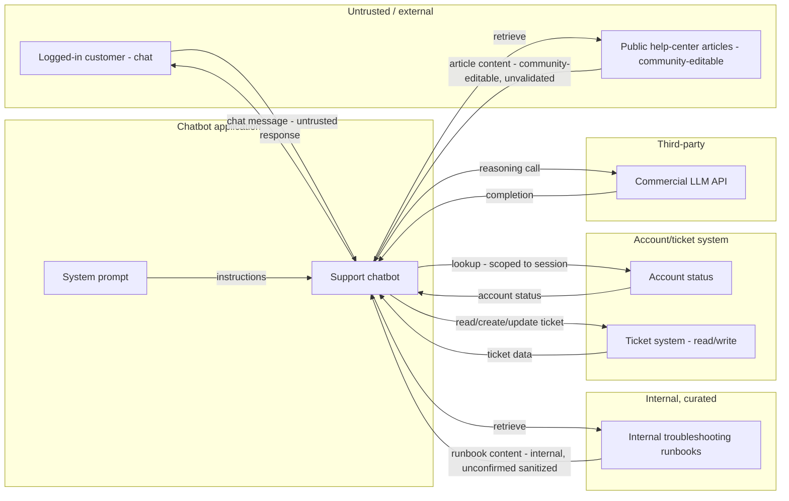

# AI Threat Model — RAG Support Chatbot

## Overview
This is a customer-support chatbot that answers questions on the company's website after a customer logs in. It looks things up in two places — public help-center articles that anyone can read (and, notably, the public can also contribute to) and internal troubleshooting guides written by support staff — and it can also check a customer's account status and create or update their support tickets. It runs on a commercially hosted AI model rather than one built in-house.

**Captured context:**
- Autonomy: acts within a chat session; can create/update tickets on the user's behalf, not just answer questions
- Model & hosting: commercial hosted API, no fine-tuning
- Tool scope: account/ticket lookups scoped to the logged-in user, but the bot also has ticket write access
- Instruction handling: no secrets embedded in the system prompt — credentials injected via runtime config
- Deployment: customer-facing website, behind login; help-center articles accept public/community contributions

## 1. Assets (Q1)
| Asset | Present | Note |
|---|---|---|
| Training/fine-tuning data | N/A | commercial hosted model, no fine-tuning |
| Model weights | N/A | vendor-owned |
| System prompt / instructions | Yes | confirmed no embedded secrets — injected via runtime config |
| Retrieved data | Yes | two sources: public help-center articles (confirmed community-editable) and internal troubleshooting runbooks |
| Tool credentials | Yes | account-status and ticket-system API credentials; confirmed not embedded in prompt |
| Account status & open tickets (PII) | Yes | per-user data, lookups confirmed scoped to the authenticated session |
| Ticket write/create/update capability | Yes | confirmed — bot is not read-only, can act on the user's behalf |

## 2. Trust boundaries & entry points (Q2)
| Entry point | Data-tagged? | Note |
|---|---|---|
| User chat messages | unconfirmed | untrusted, primary channel |
| Public help-center articles (retrieved) | unconfirmed | confirmed community-editable — an open, unauthenticated write path into the retrieval index |
| Internal troubleshooting runbooks (retrieved) | unconfirmed | internally authored, but no confirmed sanitization before retrieval — internal origin alone isn't a control |

## 3. Threat findings (Q3 — ASTRIDE × asset)
| ID | Asset | ASTRIDE | MAESTRO layer | Severity | Severity basis |
|---|---|---|---|---|---|
| T-01 | Internal troubleshooting runbooks (retrieved) | A (AI agent-specific) | Data Operations | Critical | Critical × ASR High — estimated from control coverage — no confirmed data-tagging/sanitization of retrieved runbook content before it enters the bot's context |
| T-02 | Public help-center articles (retrieved) | T (Tampering) | Data Operations | Critical | Critical × ASR High — estimated from control coverage — confirmed community-editable with no confirmed moderation gate before indexing |
| T-03 | Retrieval context (public + internal sources merged) | S (Spoofing) | Agent Frameworks | Critical | High × ASR High — estimated from control coverage — no confirmed source-tagging or trust-labeling when public and internal content are merged into one context |
| T-04 | Account status & open tickets (PII) | I (Information disclosure) | Data Operations | High | High × ASR Med — estimated from control coverage — session-scoping of lookups is confirmed present (a real positive control), but whether it's enforced independently at the tool/API layer versus only via agent reasoning is unconfirmed |
| T-05 | Ticket write/create/update capability | E (Elevation of privilege) | Agent Frameworks | High | High × ASR Med — estimated from control coverage — confirmed no human-approval gate or rate limit on ticket writes; base session scoping somewhat reduces blast radius but isn't confirmed injection-proof (see T-04) |
| T-06 | Retrieval and tool-call trail | R (Repudiation) | Evaluation & Observability | Medium | Medium × ASR Med — estimated from control coverage — no audit logging confirmed for retrieval sources or tool calls |
| T-07 | Retrieval / inference pipeline | D (Denial of service) | Deployment & Infrastructure | Medium | Medium × ASR Med — estimated from control coverage — no confirmed per-session retrieval-call rate limit or token/cost budget |
| T-08 | Tool credentials | E (Elevation of privilege) | Security & Compliance | Critical | Critical × ASR Med — estimated from control coverage — confirmed not embedded in the prompt (lowers likelihood), but lifecycle (short-lived, session-bound) is unconfirmed for the account/ticket-system API credentials |

## 4. Recommendations (by defense layer)
| ID | Defense layer | Structural control | Tool | Residual risk |
|---|---|---|---|---|
| T-01 | L3 | Treat retrieved runbook content as data even though internally authored (LLM01) — apply the same delimiting/sanitization as public content; lint for imperative-sounding phrasing before runbooks are indexed | Prompt Guard 2 applied to retrieved content · CaMeL | Doesn't stop a subtly-manipulated legitimate-looking internal update (e.g., via a compromised internal editor account) — pairs with T-08's access controls on who can edit runbooks |
| T-02 | L3 | Add a moderation/review gate before community-submitted content enters the vector index (LLM08); treat all retrieved content, public or internal, as untrusted data, never instructions | CaMeL · content-moderation pipeline before indexing | Moderation has lag and a false-negative rate — a benign-looking malicious article could pass review and get indexed before detection |
| T-03 | L1 | Structurally tag each retrieved chunk with its source and trust level (public/community vs. internal/curated) and carry that tag through to the model's context so provenance is explicit (LLM01); never merge sources into one undifferentiated block | Prompt Guard 2 · LLM Guard (source-tagging aware) | Tagging changes what the bot is told, not what it does with it — a persuasive injection could still get the bot to act on low-trust content despite the tag; pairs with T-01/T-02's content-level controls |
| T-04 | L3 | Enforce account/ticket lookup scoping at the tool/API layer against the authenticated session identity, independent of whatever the LLM decides to request, so an injected instruction asking for a different account/ticket ID is rejected before it reaches the data (I/authz) | Microsoft Agent Governance Toolkit · Presidio | If session identity itself were ever derived from conversation content rather than the auth layer, this boundary could still be probed — identity must come from authentication, not chat text |
| T-05 | L3 | Require human approval or a deterministic confirmation step before the bot creates or updates a ticket, rather than allowing silent autonomous writes (LLM06); rate-limit ticket writes per session | Microsoft Agent Governance Toolkit (execution policy) | A confirmation step only helps if the reviewer can recognize a manipulated request — pair with T-01/T-02/T-03's content controls so manipulation is caught earlier |
| T-06 | L3 | Log every retrieval (which chunks, from which source) and every tool call (lookup, ticket write) with session identity to a write-once external store for non-repudiation | Agent Governance Toolkit + external log store | Forensic only — doesn't prevent the first incident, only enables reconstructing it afterward |
| T-07 | L2 | Rate-limit retrieval calls and cap the number/size of chunks retrieved per message; per-session token/cost budget with alerting (LLM10 Unbounded Consumption) | Gateway rate limiting · usage quotas | A single semantically broad query can still pull a large, expensive context even under a per-call cap — pair with per-chunk size limits |
| T-08 | L3 | Issue short-lived, session-bound tokens for the account/ticket APIs instead of a standing service credential (LLM06); bind token validity to the authenticated session's lifetime | Microsoft Agent Governance Toolkit (credential/session scoping) | A compromised token is still valid for that session's full scope/duration — pairs with T-04's independent enforcement to bound what the token can actually be used for |

## 5. Pre-deploy validation checklist
| Q | Check | Status | Basis |
|---|---|---|---|
| Q1 | Assets fully inventoried | PASS | all five classes named (N/A training data/weights given hosted model) plus system-specific assets (two retrieval sources, account/ticket PII, ticket write capability) |
| Q2 | Every untrusted entry point delimiter-tagged as data | FAIL | chat messages, public articles, and internal runbooks all unconfirmed as data-tagged (T-01, T-02, T-03) |
| Q3 | ASTRIDE worst case captured per asset | PASS | all 7 categories represented across 8 findings |
| Q4 | Every tool call least-privilege: scoped, short-lived, caller-bound | FAIL | ticket writes ungated (T-05); lookup scoping not confirmed enforced independent of agent reasoning (T-04); account/ticket API credentials not confirmed short-lived or session-bound (T-08) |
| Q5 | ASR baseline defined and met, pre-launch + continuous | GAP | no eval/red-team pipeline confirmed; every finding above is estimated from control coverage, not measured |

**Net: 2 FAIL, 1 GAP, 2 PASS — NOT READY TO SHIP.**

## 6. Assumption register
- Chat/session memory is per-session only — no persistent cross-session memory confirmed either way
- No MCP/other-agent connections — single chatbot system, Agent Ecosystem layer not applicable
- Cloud-hosted, internet-facing, behind user login
- No specific compliance regime (GDPR/HIPAA/PCI) flagged for this system
- Confirmed via intake: no secrets in system prompt, help-center articles are community-editable, ticket lookups are session-scoped but the bot can write tickets, commercial hosted model with no fine-tuning
