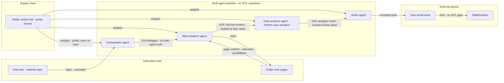

# AI Threat Model — Multi-Agent Research Workflow

## Overview
This system takes a research topic from a user and automatically produces a written research brief, without any human checking the work along the way. Behind the scenes, four AI agents split the task: one searches and reads public web pages, one analyzes what it finds by running code, and one writes the final brief, which is then emailed to stakeholders automatically. The underlying AI model runs on the company's own infrastructure rather than a paid, hosted service, and the agents talk to each other directly to hand off work.

**Captured context:**
- Autonomy: fully autonomous — no human review between topic submission and the brief being emailed
- Model & hosting: self-hosted open-weights model downloaded from a public hub, in its default (pickle-based) format
- Tool scope: web-research agent fetches arbitrary public pages; data-analysis agent runs Python in an ephemeral sandbox with no persistent storage or outbound network; writer agent sends email with no approval step
- Instruction handling: no secrets embedded in agent prompts — credentials injected via runtime config
- Deployment: cloud service; agents communicate over A2A with no inter-agent authentication confirmed

## 1. Assets (Q1)
| Asset | Present | Note |
|---|---|---|
| Training/fine-tuning data | N/A | pretrained open-weights model used as-is, no fine-tuning stated |
| Model weights | Yes | self-hosted, downloaded from a public hub in pickle-based format (confirmed, not yet safetensors) — a real high-sensitivity asset since it's self-hosted, not vendor-owned |
| System prompt / instructions | Yes | one per agent (orchestrator, web-research, data-analysis, writer); confirmed no embedded secrets — injected via runtime config |
| Retrieved data | Yes | arbitrary public web page content fetched by the web-research agent — highly untrusted, attacker-reachable |
| Tool credentials | Yes | email/SMTP send credentials and code-exec provisioning creds; confirmed not embedded in prompts |
| A2A inter-agent channel | Yes | confirmed: no authentication between agents — content trusted at face value |
| Code-execution sandbox | Yes | confirmed ephemeral, no persistent filesystem, no outbound network — but its output/return channel is not similarly isolated |
| Outbound stakeholder email | Yes | auto-sent with zero human-in-the-loop review |

## 2. Trust boundaries & entry points (Q2)
| Entry point | Data-tagged? | Note |
|---|---|---|
| User-submitted topic | unconfirmed | primary direct-channel input to the orchestrator agent |
| Fetched public web page content | unconfirmed | arbitrary, attacker-reachable — the system's highest-risk indirect-injection surface |
| A2A messages between agents | no | confirmed at intake: no inter-agent auth, content trusted at face value with no re-validation at any hop |

## 3. Threat findings (Q3 — ASTRIDE × asset)
| ID | Asset | ASTRIDE | MAESTRO layer | Severity | Severity basis |
|---|---|---|---|---|---|
| T-01 | Fetched web page content | A (AI agent-specific) | Data Operations | Critical | Critical × ASR High — estimated from control coverage — no delimiting/sanitization of fetched web content confirmed before it enters agent reasoning |
| T-02 | Cross-agent pipeline (web → analysis → writer → email) | A (AI agent-specific) | Agent Ecosystem | Critical | Critical × ASR High — estimated from control coverage — confirmed no inter-agent re-validation and no HITL anywhere in the chain |
| T-03 | A2A inter-agent channel | S (Spoofing) | Agent Ecosystem | Critical | High × ASR High — estimated from control coverage — confirmed at intake: no authentication between agents over A2A |
| T-04 | Code-execution sandbox | E (Elevation of privilege) | Deployment & Infrastructure | High | High × ASR Med — estimated from control coverage — sandbox is confirmed ephemeral with no persistent filesystem or outbound network, which meaningfully reduces host-compromise likelihood, but does not address exfiltration via the sandbox's own legitimate return value |
| T-05 | Model weights | T (Tampering) | Foundation Models | Critical | Critical × ASR Med — estimated from control coverage — confirmed pickle-based format with no scanning or safetensors migration; requires the specific public artifact to be poisoned, a separate precondition from the runtime web-injection path |
| T-06 | Outbound stakeholder email | I (Information disclosure) | Agent Frameworks | Critical | Critical × ASR High — estimated from control coverage — confirmed no human review anywhere between topic submission and email send |
| T-07 | Cross-agent tool-call trail | R (Repudiation) | Evaluation & Observability | Medium | Medium × ASR Med — estimated from control coverage — no audit logging confirmed across the 4-agent A2A pipeline |
| T-08 | Web-fetch / inference pipeline | D (Denial of service) | Deployment & Infrastructure | Medium | Medium × ASR Med — estimated from control coverage — no confirmed page-count/size limits or per-job compute budget on the web-research agent |
| T-09 | User-submitted topic | A (AI agent-specific) | Agent Frameworks | Critical | Critical × ASR High — estimated from control coverage — no confirmed delimiting of the topic field as data vs. instructions to the orchestrator |
| T-10 | Tool credentials | E (Elevation of privilege) | Security & Compliance | Critical | Critical × ASR Med — estimated from control coverage — confirmed not embedded in prompts (lowers likelihood vs. a refund-agent-style leak), but lifecycle (short-lived, per-job scoped, caller-bound) is unconfirmed for the email-send and code-exec provisioning credentials |

## 4. Recommendations (by defense layer)
| ID | Defense layer | Structural control | Tool | Residual risk |
|---|---|---|---|---|
| T-01 | L3 | Treat fetched web content as data, never instructions (LLM01) — structural separation at the web-research agent's ingestion point; strip imperative-sounding text before including it in any A2A payload | Prompt Guard 2 applied to fetched content · CaMeL | A novel/obfuscated payload (encoded, split across pages) could still evade content filtering — downstream privilege separation (T-04, T-06) is the real backstop |
| T-02 | L3 | Cross-layer cascade (LLM01 root cause): a web-page injection propagates via A2A into the analysis agent, drives attacker-influenced code execution, and the writer agent auto-emails the result — no checkpoint anywhere. Re-validate content as untrusted data at every A2A hop; gate the final email behind a human or a deterministic (non-LLM) check. This is the Rule-of-Two lethal trifecta materializing: untrusted web input [A] + code-exec/sensitive access [B] + external email egress [C] in one continuous, ungated session | Microsoft Agent Governance Toolkit · CaMeL | If the re-validation step is itself LLM-based it inherits the same injection risk — the final email gate specifically needs a deterministic check, not just another model call |
| T-03 | L3 | Add authentication between agents over A2A (signed messages / mTLS) (LLM06); vet the A2A message schema/handlers before wiring agents together | Invariant MCP-Scan (A2A equivalent) · Microsoft Agent Governance Toolkit | Authenticating who sent a message doesn't validate what it says — a legitimately-authenticated-but-compromised agent can still send malicious content (see T-02's content re-validation control) |
| T-04 | L3 | Treat the sandbox's output as untrusted data too, not pre-cleared for the writer/email step (LLM06); add resource/time limits on the ephemeral container; scope the code-exec tool to the specific operation needed, not general-purpose eval | CaMeL · Microsoft Agent Governance Toolkit (execution policy) | The confirmed no-persistent-FS/no-outbound-network control stops host-level exfil but not exfil via the analysis result itself flowing downstream to email — that gap is covered by T-02, not this control alone |
| T-05 | L4 | Migrate to safetensors before serving (LLM03/LLM04); pin the exact model revision/hash from the hub; verify signature/attestation if available | ModelScan · Hugging Face PickleScan | If the hub listing doesn't offer safetensors, migration requires an out-of-band conversion in a controlled environment — until then, scanning mitigates but doesn't structurally close the executable-format risk |
| T-06 | L3 | Require human approval before any email leaves the pipeline (HITL gate) (LLM06); scope the email tool to a pre-approved recipient list rather than open-ended send | Microsoft Agent Governance Toolkit | A HITL gate only helps if the reviewer can recognize a subtly-manipulated brief — pair with automated output classification so the human isn't the only check |
| T-07 | L3 | Log every A2A message and tool call (web fetch, code exec, email send) with content hashes and originating-agent identity to a write-once external store; no single OWASP LLM ID maps directly to this — flagged as a general governance/observability requirement | Agent Governance Toolkit + external log store | Logging is forensic, not preventive — it enables reconstructing a cascade after the fact but won't stop the first occurrence |
| T-08 | L2 | Cap pages fetched and page size per job; per-job compute/token budget with hard cutoff; alert on spend velocity (LLM10 Unbounded Consumption) | Gateway rate limiting · usage quotas | A single well-crafted large/expensive page can still drive cost even under a page-count cap — pair with per-request size/complexity limits |
| T-09 | L1 | Structural separation between fixed system instructions and the topic field (LLM01); bound the topic field to a validated schema (length/character constraints) rather than free-form text concatenated into orchestrator instructions | Prompt Guard 2 · LLM Guard | Even a bounded field can carry an injection payload if not also filtered for imperative phrasing — pair with L3's downstream re-validation and the T-06 HITL gate as defense-in-depth |
| T-10 | L3 | Issue short-lived, per-job-scoped credentials for email-send and code-exec provisioning rather than long-lived standing creds (LLM06); bind each credential's validity to the specific job/session that requested it so a compromised agent process can't reuse it beyond that job | Microsoft Agent Governance Toolkit (credential/session scoping) | Short-lived scoping caps blast radius across jobs but not within one — if the T-02 cascade executes inside a live job's window, a correctly-scoped credential is still sufficient for that job's own malicious action (e.g., the one exfiltrating email) |

## 5. Pre-deploy validation checklist
| Q | Check | Status | Basis |
|---|---|---|---|
| Q1 | Assets fully inventoried | PASS | all five classes named (weights present and high-sensitivity since self-hosted) plus system-specific assets (A2A channel, sandbox, outbound email) |
| Q2 | Every untrusted entry point delimiter-tagged as data | FAIL | topic field, fetched web content, and A2A messages all unconfirmed or confirmed-not data-tagged (T-01, T-02, T-03, T-09) |
| Q3 | ASTRIDE worst case captured per asset | PASS | all 7 categories represented across 10 findings, including the cross-layer cascade (T-02) spanning Data Operations → Agent Ecosystem |
| Q4 | Every tool call least-privilege: scoped, short-lived, caller-bound | FAIL | Rule-of-Two lethal trifecta present: untrusted web input [A] + code-exec/sensitive access [B] + external email egress [C] all in one continuous, ungated multi-agent session (T-02); A2A has no inter-agent auth (T-03); email tool unrestricted (T-06); email/code-exec credentials not confirmed short-lived or job-scoped (T-10) |
| Q5 | ASR baseline defined and met, pre-launch + continuous | GAP | no eval/red-team pipeline confirmed; the system is fully autonomous with zero human checkpoints between topic submission and external email, which raises the bar for what an acceptable baseline must cover before launch |

**Net: 2 FAIL, 1 GAP, 2 PASS — NOT READY TO SHIP.**

## 6. Assumption register
- Pipeline is stateless per research job — no persistent memory across separate topic submissions confirmed either way
- No persistent RAG/vector store beyond the web-research agent's ad hoc page fetches
- Cloud-hosted and internet-facing for both inbound job submission and outbound web-fetch/email egress
- No specific compliance regime (GDPR/HIPAA/PCI) flagged for this system
- Confirmed via intake: no secrets embedded in agent prompts, code-exec sandbox is ephemeral with no persistent FS/outbound network, no inter-agent A2A authentication, model weights are pickle-based (not yet safetensors)
